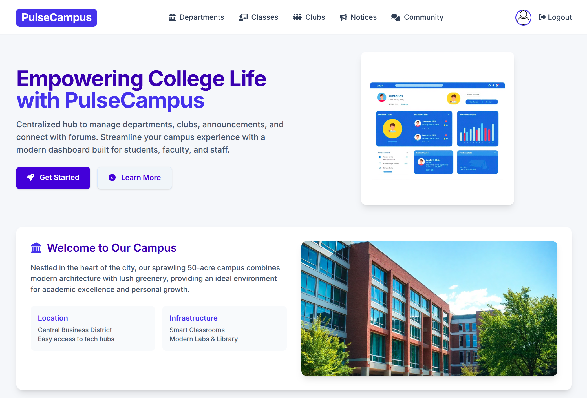

<p align="center"><h1 align="center">PULSE CAMPUS</h1></p>
<h3 align="center">
Check out: <a href="https://pulsecampus.asiradnan.com/">https://pulsecampus.asiradnan.com/</a>
</h3>
<p align="center">Built with the tools and technologies:</p>
<p align="center">
    
    
    
    
	
    
</p>
<br>
<p align="center">
  
</p>

##  Table of Contents
- [Overview](#overview)
- [Tech](#tech)
- [Features](#features)
    - [Role Based Access Control](#role-based-access-control)
    - [Authentication](#authentication)
    - [Departments and Classes](#departments-and-classes)
    - [Clubs](#clubs)
    - [Announcements and Community](#announcements-and-community)
    - [Profile](#profile)
- [Project Structure](#project-structure)
- [Getting Started](#getting-started)
  - [Prerequisites](#prerequisites)
  - [Installation](#installation)
  - [Testing](#testing)
- [License](#license)
##  Overview
 PulseCampus is a modern web app designed for colleges to manage departments, student clubs, announcements, and forums.

---

## Tech
- **Backend:** Python, Django, Celery, Redis
- **Frontend:** HTML, CSS, JavaScript, Django Templates
- **Database:** PostgreSQL (Amazon RDS)
- **Testing:** Python Unittest, Django Test, Coverage
- **CI/CD:** GitHub Actions for Continuous Integration and Deployment 
- **Hosting:** Amazon EC2, Gunicorn, Nginx
- **Media:** Amazon S3
- **Async Task:** Celery, Redis
- **Email:** Amazon SES


##  Features

#### Role Based Access Control
- Principal can create and manage departments, classes
- Teachers can create, manage and supervise Clubs
- Teachers can manage class captain and club memberships
- Principal and Teachers can make announcements
- Students can post and comment queries and concerns in forum
- Verified users can log in
  
#### Authentication
- Signup and Login, Logout
- Email verification
- Password reset 

#### Departments and Classes
- Departments with teachers and room number
- Classes with class captain, room number and students
- Principal can create, edit and delete departments and classes
#### Clubs
- Teacher as supervisor
- Students as members
- Different club positions managed by Club Supervisor
- Teachers can create, edit and delete clubs

#### Announcements and Community
- Announcements with files attached
- Forum with posts, comments, upvotes and downvotes
- Edit and delete own posts and comments

#### Profile
- Profile view with user information and profile picture
- Update profile information and profile picture
- Change password and account deletion


##  Project Structure

```sh
└── PulseCampus/
    ├── .github
    │   └── workflows
    ├── PulseCampus
    │   ├── __init__.py
    │   ├── asgi.py
    │   ├── celery.py
    │   ├── mixins.py
    │   ├── settings.py
    │   ├── settings_test.py
    │   ├── tests.py
    │   ├── urls.py
    │   ├── validators.py
    │   ├── views.py
    │   └── wsgi.py
    ├── README.md
    ├── classes
    │   ├── __init__.py
    │   ├── admin.py
    │   ├── apps.py
    │   ├── migrations
    │   ├── models.py
    │   ├── tests
    │   ├── urls.py
    │   └── views.py
    ├── clubs
    │   ├── __init__.py
    │   ├── admin.py
    │   ├── apps.py
    │   ├── forms.py
    │   ├── migrations
    │   ├── models.py
    │   ├── tests
    │   ├── urls.py
    │   └── views.py
    ├── community
    │   ├── __init__.py
    │   ├── admin.py
    │   ├── apps.py
    │   ├── forms.py
    │   ├── migrations
    │   ├── models.py
    │   ├── tests
    │   ├── urls.py
    │   └── views.py
    ├── departments
    │   ├── __init__.py
    │   ├── admin.py
    │   ├── apps.py
    │   ├── migrations
    │   ├── models.py
    │   ├── tests
    │   ├── urls.py
    │   └── views.py
    ├── manage.py
    ├── notice
    │   ├── __init__.py
    │   ├── admin.py
    │   ├── apps.py
    │   ├── forms.py
    │   ├── migrations
    │   ├── models.py
    │   ├── tests
    │   ├── urls.py
    │   └── views.py
    ├── requirements.txt
    ├── static
    │   └── college.png
    ├── templates
    │   ├── 404.html
    │   ├── admin
    │   ├── auth_base.html
    │   ├── base.html
    │   ├── classes
    │   ├── clubs
    │   ├── community
    │   ├── departments
    │   ├── homepage.html
    │   ├── notice
    │   └── users
    └── users
        ├── __init__.py
        ├── admin.py
        ├── apps.py
        ├── forms.py
        ├── migrations
        ├── models.py
        ├── signals.py
        ├── tasks.py
        ├── tests
        ├── urls.py
        └── views.py
```

##  Getting Started

###  Prerequisites

Before getting started with PulseCampus, ensure your runtime environment meets the following requirements:

- **Programming Language:** Python
- **Package Manager:** Pip


Install PulseCampus using one of the following methods:

###  Installation

1. Clone the PulseCampus repository:
```sh
git clone https://github.com/asiradnan/PulseCampus
```

2. Navigate to the project directory:
```sh
cd PulseCampus
```

3. Install the project dependencies:
```sh
pip install -r requirements.txt
```
4. Run the project:
```sh
python manage.py runserver
```

###  Testing
Run the test suite using the following command:
```sh
coverage run manage.py test --settings=PulseCampus.settings_test
```

##  License

This project is protected under the [MIT](https://choosealicense.com/licenses/mit/) License. For more details, refer to the [LICENSE](https://github.com/asiradnan/PulseCampus/blob/main/LICENSE) file.

---
